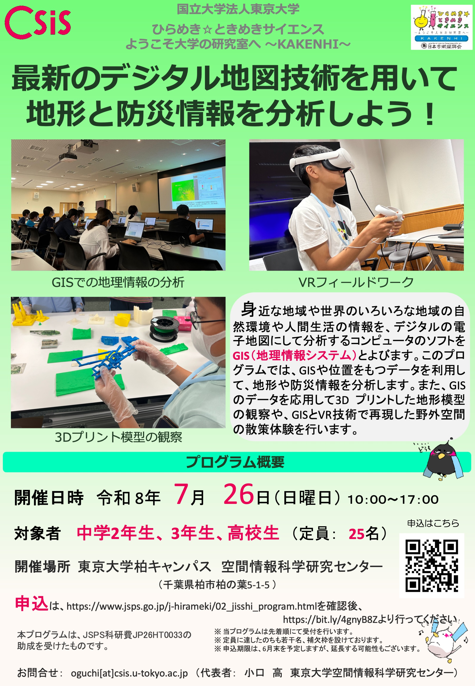

# 最新のデジタル地図技術を用いて地形と防災情報を分析しよう！開催概要
ひらめき☆ときめきサイエンス「最新のデジタル地図技術を用いて地形と防災情報を分析しよう！」の開催概要、注意事項についてまとめたページです。本ページは申込者への連絡を想定したもので、新たに参加者を募集するためのページではありません。（2026/6/13更新）

- [開催概要](#1)
- [持ち物](#2)
- [アクセス](#3)
- [注意事項](#4)
- [Q&A](#5)

 

## 開催概要

- 日時：7月26日（日）10：00～17：00
- 場所：千葉県柏市柏の葉5-1-5　東京大学空間情報科学研究センター
- 対象：中学生2年生〜高校生
- 講師：[小口 高](http://oguchaylab.csis.u-tokyo.ac.jp/members.html)、[矢澤 優理子](https://yurikoyazawa.wixsite.com/yazawayuriko)（東京大）、[小倉拓郎](https://www.geoguraphy.com/)（一橋大/東京大）、[山内啓之](https://researchmap.jp/hyamauchi/)（立命館大学/東京大）ほか
- 内容：本プログラムは、地理情報システム、3Dプリンタ、VR機材を用いて防災や地形について実習形式で解説するものです。詳細は、[こちら](https://www.jsps.go.jp/file/storage/kaken_hirameki_26/26ht0033.pdf)から確認してください。
- 申し込みは、[https://bit.ly/4gnyB8Z](https://bit.ly/4gnyB8Z)からも行えます。

> ひらめき☆ときめきサイエンスの公式ページは、[https://www.jsps.go.jp/j-hirameki/02_jisshi_program.html](https://www.jsps.go.jp/j-hirameki/02_jisshi_program.html)です。本プログラムは、PDF４枚目の千葉県欄に記載があります。お問い合わせの先からの申し込みと説明がありますが、上記のフォームからお申し込みください。

## プログラム

|時間|内容|
|---|:---:|
|9:30〜10:00|受付（集合場所:柏キャンパス総合研究棟 6F）|
|10:00〜10:10|開講式（あいさつ、科研費の説明）|
|10:10〜10:30|講義「GIS とは?地理空間情報とその活用」（終了後 10 分休憩）|
|10:40〜12:10|実習 1「GIS を用いた Web ハザードマップの読み取りと分析」|
|12:10〜13:00|昼食|
|13:00〜14:30|実習 2「GIS を用いた地形と災害情報の分析」（終了後 10 分休憩）|
|14:40〜15:05|クッキータイム・大学生との交流・質疑応答（終了後 5 分休憩）|
|15:10〜16:40| 実習 3「VR、3D プリントによる地形・災害情報の可視化」（終了後 5 分休憩）|
|16:45〜17:00|修了式（アンケート記入、未来博士号授与）|
|17:00|終了、解散|

> 昼休憩時には、ランチタイムトークとして、昼食をとりながら聞ける講演（20分程度）を予定する可能性があります。

## 持ち物、服装

- 筆記用具
- お弁当
- 飲み物（当日、お茶の配布もあります）
- 動きやすい服装
- ゴミ袋（各自のゴミを持ち帰る用の袋）
- Windowsのノートパソコン（可能な方のみ）
- スマートフォン（可能な方のみ）

## アクセス
東京大学柏キャンパスへのアクセスは、[東京大学CSISホームページ](http://www.csis.u-tokyo.ac.jp/location/)をご確認ください。構内の駐車は不可ですので、可能な限り公共交通機関をご利用ください。

## 注意事項

|注意事項|対応|
|---|---|
|申し込み者は、必ず当日の朝、体温を計測してください。|平熱を超える場合や風邪の症状がある場合は参加できません。|
|欠席、遅刻等の連絡|申し込み後に案内を送付します。何かご要望があればそのメールアドレスにご連絡ください。欠席の際は、円滑なプログラムの実施のため、お早めにお知らせください。|
|自然災害のおそれがある場合による中止|当日、プログラムの開催が困難と判断した場合、午前8時までに参加者へ中止の連絡をします。|
|自動車の駐車（構内での駐車不可）|自動車でお越しになる場合は、構内での駐車が不可のため周辺の有料駐車場等をご利用ください。|
|保険加入|こちらで、受講生全員を対象としたレクリエーション保険に加入しています。|

## Q＆A
以下は過去に、実際にあった質問と回答です。本年度も全員と関連する質問をいただいた場合は、質問の概要とその回答を順次追加します。原則、電話による質問対応はできかねますため、お問い合わせの場合はメールでの連絡をお願いいたします。

### Q.同伴者（保護者など）は、プログラムを見学できますか？
A.会場の広さの都合上、事前に参加希望をお知らせください。

### Q.同伴者の休憩スペースは、ありますか？
A. ございません。同伴者は受講者とともに移動していただきます（各教室の後ろで椅子にすわり、プログラムを見学ください）。

### Q.当日の都合が変わり、終日参加が難しいですが途中退場は可能ですか？
A. 問題ありませんが、参加証授与等の関係があるため、事前に連絡をください。

### 学食は利用できますか？
A. 当日は、構内のすべての学食が空いていません。参加者は、必ず昼食をご持参ください。※大学（会場）の最寄りに、ファミリーマートがあります。

### Q.当日に参加者（同伴者含む）が利用できるWi-Fiはありますか？
A. 設備やセキュリティ対策などの点で、イベント以外の用途でWi-Fiを利用いただくことはできません。参加者向けにWi-FiのIDとPASSを配布することもありません。